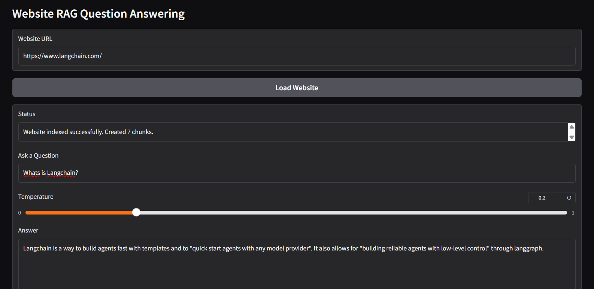
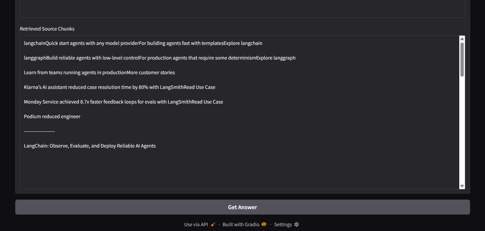

# 🤖 GenAI Addon

> A Retrieval-Augmented Generation (RAG) chatbot built with **Gradio**, **LangChain**, **Groq LLM**, **FAISS**, and **Hugging Face Embeddings**.

The application enables users to ingest web content, create a semantic vector database, and interact with the extracted knowledge through an intuitive conversational interface.

---

## 📸 Screenshots

### Home Interface

<p align="center">
  
</p>

### Chat Interface

<p align="center">
  
</p>

---

## ✨ Features

- 🌐 Load and process web pages using **LangChain WebBaseLoader**
- 📄 Automatically split documents into manageable chunks
- 🧠 Generate semantic embeddings with **Hugging Face Sentence Transformers**
- ⚡ Store embeddings efficiently using **FAISS**
- 🤖 Generate intelligent responses using **Groq LLM**
- 🔍 Retrieval-Augmented Generation (RAG) pipeline
- 💬 Interactive Gradio web interface
- 📚 Context-aware question answering

---

## 🛠️ Tech Stack

| Technology | Purpose |
|------------|---------|
| Python | Programming Language |
| Gradio | Web Interface |
| LangChain | LLM Framework |
| Groq | Large Language Model |
| Hugging Face | Embeddings |
| FAISS | Vector Database |
| Sentence Transformers | Text Embeddings |

---

## 📂 Project Structure

```text
GenAI_addon/
│
├── app.py
├── README.md
├── requirements.txt
├── assets/
│   ├── g11.png
│   └── g12.png
├── sample_data/
│
├── .gitignore
└── ...
```

---

## ⚙️ Installation

### 1. Clone the Repository

```bash
git clone https://github.com/muzml/GenAI_addon.git
```

### 2. Navigate to the Project

```bash
cd GenAI_addon
```

### 3. Install Dependencies

```bash
pip install -r requirements.txt
```

### 4. Set Your Groq API Key

Create a `.env` file or export your API key.

Example:

```env
GROQ_API_KEY=your_api_key_here
```

---

### 5. Run the Application

```bash
python app.py
```

The Gradio interface will launch in your browser.

---

## 🔄 How It Works

1. Enter a webpage URL.
2. The webpage is loaded using **LangChain WebBaseLoader**.
3. Documents are split into smaller chunks.
4. Chunks are converted into embeddings using **Hugging Face**.
5. Embeddings are stored in a **FAISS** vector database.
6. User questions retrieve the most relevant chunks.
7. **Groq LLM** generates accurate, context-aware answers.

---

## 📦 Dependencies

- gradio
- langchain
- langchain-community
- langchain-groq
- langchain-huggingface
- faiss-cpu
- sentence-transformers
- beautifulsoup4
- requests

Install everything with:

```bash
pip install -r requirements.txt
```

---

## 🚀 Future Improvements

- 📂 PDF document support
- 📄 Multiple document ingestion
- 💾 Persistent vector database
- 🧠 Conversation memory
- 🌍 Multi-language support
- 🔐 User authentication
- ☁️ Cloud deployment
- 📊 Source citation for responses

---

## 🤝 Contributing

Contributions are welcome!

1. Fork the repository.
2. Create a new feature branch.

```bash
git checkout -b feature-name
```

3. Commit your changes.

```bash
git commit -m "Add feature"
```

4. Push the branch.

```bash
git push origin feature-name
```

5. Open a Pull Request.

---

## 📄 License

This project is released under the **MIT License**.

---

## 👨‍💻 Author

**Muzammil Latheef**

- GitHub: https://github.com/muzml

---

⭐ If you found this project useful, consider giving it a star on GitHub!
